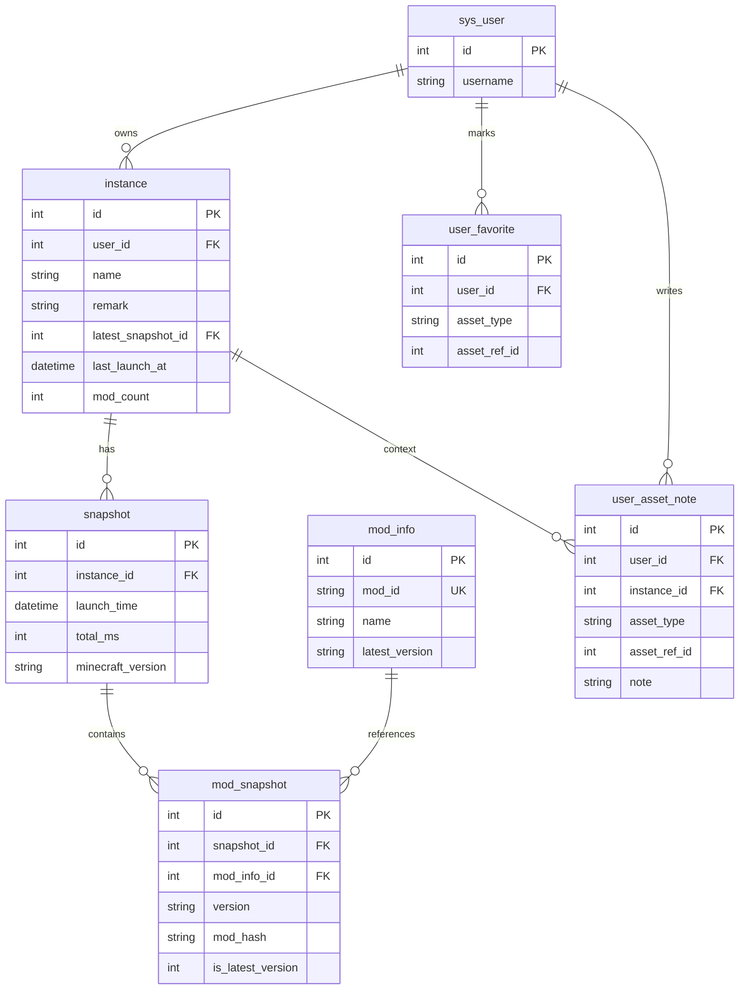
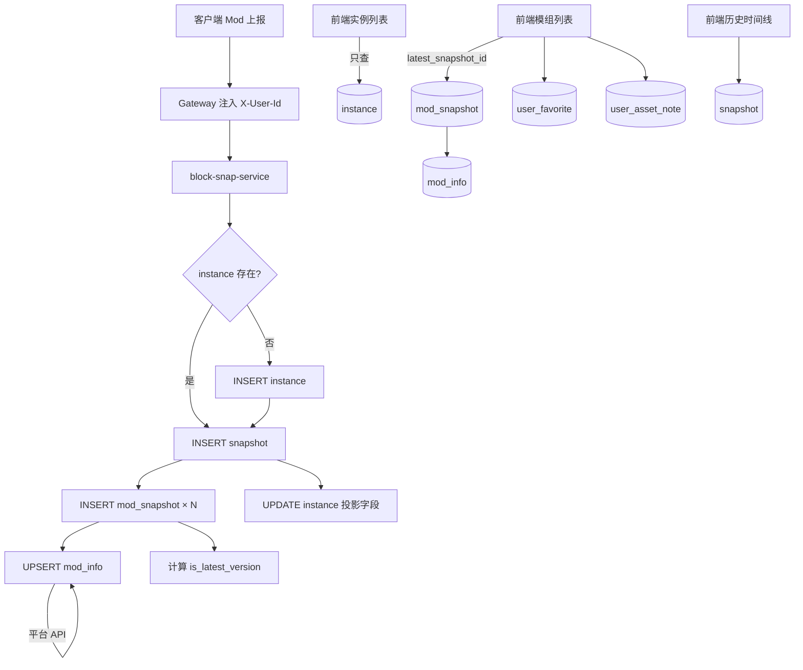

# Block Snap — 数据结构与流转（定稿）

> 本文档为当前项目的数据模型与数据流唯一权威说明。  
> 开发、建表、接口设计均以本文为准。

---

## 一、项目定位（简述）

Block Snap 追踪 Minecraft **游戏实例**在时间维度上的资产变化：模组、资源包、光影包、配置文件等。

核心问题：**玩家离开一段时间后，实例里发生了什么变化？**

```
账户 → 实例 → 快照 → 资产明细
```

---

## 二、层级结构

```
sys_user（账户）
    │
    └── instance（游戏实例 — 容器 + 当前展示投影）
            │
            └── snapshot（一次启动的综合快照 — 表头）
                    ├── mod_snapshot（模组成员）
                    ├── resource_snapshot（资源包成员，后续）
                    ├── shader_snapshot（光影成员，后续）
                    └── config_snapshot（配置成员，后续）

mod_info（模组全局字典 — 平台侧，不属于某次快照）
user_favorite（用户收藏）
user_asset_note（用户对资产的备注）
```

### 关系说明

| 关系 | 含义 |
|------|------|
| `sys_user` 1:N `instance` | 一个账户多个游戏实例 |
| `instance` 1:N `snapshot` | 一个实例多次启动 |
| `snapshot` 1:N `mod_snapshot` | 一次快照包含多个模组 |
| `mod_info` 1:N `mod_snapshot` | 同一模组出现在多次快照中 |
| `instance` 投影自最新 `snapshot` | 实例列表页直接查 instance，不现场连表 |

### 命名约定

| 表名 | 角色 | 说明 |
|------|------|------|
| `instance` | 独立实体 | **不要**叫 `snapshot_instance`；实例拥有快照，不是快照的成员 |
| `snapshot` | 快照聚合根（表头） | 一次启动的综合快照的公共信息 |
| `mod_snapshot` | 快照成员 | **不要**改成 `snapshot_mod` 也行，但项目统一用 `*_snapshot` 后缀 |
| `mod_info` | 全局字典 | 不带 snapshot 前缀 |

---

## 三、表职责分类

按**数据角色**分四类，不要按「给谁看」和「从哪来」混用两条轴：

| 角色 | 表 | 写入后是否改 | 说明 |
|------|-----|-------------|------|
| **事实层** | `snapshot`、`mod_snapshot` 等 | 原则上不改 | 记录「那次启动发生了什么」 |
| **字典层** | `mod_info` | 平台异步更新 | 跨用户、跨实例共享 |
| **投影层** | `instance` | 每次上传覆盖 | 最新快照的展示缓存，服务前端列表 |
| **用户态** | `user_favorite`、`user_asset_note`、`instance.remark` | 用户随时改 | 备注、收藏，不属于快照事实 |

### 关键认知

1. **`snapshot` 是综合快照的表头**，`mod_snapshot` 是它的一部分，不是并列的另一套东西。
2. **`instance` 不是原始数据源**，展示字段来自最新一次 `snapshot` 的投影。
3. **`mod_snapshot` 是模组事实表**，不是「前端展示表」；`mod_hash` 等字段前端可能不显示，但对 Diff、平台查询至关重要。
4. **历史版本查看**走 `snapshot` 列表，**不需要** `instance_snapshot` 表。

---

## 四、表结构

### 4.1 sys_user（已有，block-snap-system）

账户与登录，由 `block-snap-system` 模块维护。

```
id, username, password, nickname, phone, email,
status, is_deleted, create_time, update_time, ...
```

---

### 4.2 instance（游戏实例）

**职责**：实例身份 + 前端实例卡片当前展示字段。

```sql
CREATE TABLE `instance` (
    `id`                   INT          NOT NULL AUTO_INCREMENT PRIMARY KEY COMMENT '实例ID',
    `user_id`              INT          NOT NULL COMMENT '所属用户，FK → sys_user.id',
    `name`                 VARCHAR(128) NOT NULL COMMENT '实例名称',
    `client_key`           VARCHAR(64)           COMMENT '客户端生成的实例唯一标识，用于上报匹配',
    `remark`                 VARCHAR(500)          COMMENT '用户对实例的备注',

    -- 绑定整合包（可选，整合包表后续建）
    `bound_modpack_id`     INT                   COMMENT '绑定的整合包ID，可为空',

    -- 以下字段为「最新 snapshot」的投影，每次上传后 UPDATE
    `minecraft_version`    VARCHAR(32)           COMMENT '当前展示的 MC 版本',
    `loader_type`          VARCHAR(32)           COMMENT 'FORGE / FABRIC',
    `loader_version`       VARCHAR(64)           COMMENT '加载器版本',
    `java_version`         VARCHAR(64)           COMMENT 'Java 版本',
    `modpack_name`         VARCHAR(128)          COMMENT '整合包名称（展示用）',
    `modpack_version`      VARCHAR(64)           COMMENT '整合包版本（展示用）',
    `source_platform`      VARCHAR(32)           COMMENT '整合包来源平台',
    `mod_count`            INT          NOT NULL DEFAULT 0 COMMENT '最新快照活跃模组数',
    `resource_count`       INT          NOT NULL DEFAULT 0 COMMENT '最新快照活跃资源包数',
    `shader_count`         INT          NOT NULL DEFAULT 0 COMMENT '最新快照活跃光影数',
    `pending_update_count` INT          NOT NULL DEFAULT 0 COMMENT '待更新资产数（展示用）',
    `last_launch_at`       DATETIME              COMMENT '最近启动时间',
    `last_total_ms`        INT                   COMMENT '最近总加载耗时(ms)',
    `latest_snapshot_id`   INT                   COMMENT '最新快照ID，FK → snapshot.id',

    `is_deleted`           TINYINT(1)   NOT NULL DEFAULT 0,
    `create_time`          DATETIME     NOT NULL DEFAULT CURRENT_TIMESTAMP,
    `update_time`          DATETIME     NOT NULL DEFAULT CURRENT_TIMESTAMP ON UPDATE CURRENT_TIMESTAMP,

    UNIQUE KEY `uk_user_client_key` (`user_id`, `client_key`),
    KEY `idx_user_id` (`user_id`),
    KEY `idx_user_last_launch` (`user_id`, `last_launch_at` DESC)
) ENGINE=InnoDB DEFAULT CHARSET=utf8mb4 COMMENT='游戏实例（容器 + 当前展示投影）';
```

---

### 4.3 snapshot（快照表头）

**职责**：一次客户端上传 = 一条 snapshot。包含该次启动的环境信息与耗时。

```sql
CREATE TABLE `snapshot` (
    `id`                INT          NOT NULL AUTO_INCREMENT PRIMARY KEY COMMENT '快照ID',
    `instance_id`       INT          NOT NULL COMMENT 'FK → instance.id',
    `launch_time`       DATETIME     NOT NULL COMMENT '本次启动时间（客户端采集）',
    `total_ms`          INT                   COMMENT '总加载耗时(ms)',
    `game_ready_ms`     INT                   COMMENT '进入主菜单耗时(ms)',

    -- 本次启动的运行环境（历史事实，写入后不改）
    `minecraft_version` VARCHAR(32)           COMMENT '本次 MC 版本',
    `loader_type`       VARCHAR(32)           COMMENT 'FORGE / FABRIC',
    `loader_version`    VARCHAR(64)           COMMENT '加载器版本',
    `java_version`      VARCHAR(64)           COMMENT 'Java 版本',
    `ram_allocated`     VARCHAR(16)           COMMENT '分配内存',

    -- 本次快照资产数量（写入时统计）
    `mod_count`         INT          NOT NULL DEFAULT 0,
    `resource_count`    INT          NOT NULL DEFAULT 0,
    `shader_count`      INT          NOT NULL DEFAULT 0,

    `create_time`       DATETIME     NOT NULL DEFAULT CURRENT_TIMESTAMP COMMENT '服务端接收时间',

    KEY `idx_instance_launch` (`instance_id`, `launch_time` DESC)
) ENGINE=InnoDB DEFAULT CHARSET=utf8mb4 COMMENT='一次启动的综合快照（表头）';
```

---

### 4.4 mod_info（模组全局字典）

**职责**：平台侧模组信息，由 `mod_snapshot` 上报后沉淀 + 平台 API 异步回填。

```sql
CREATE TABLE `mod_info` (
    `id`              INT          NOT NULL AUTO_INCREMENT PRIMARY KEY,
    `mod_id`          VARCHAR(128) NOT NULL COMMENT '客户端读取的全局标识，如 create、jei',
    `name`            VARCHAR(256) NOT NULL COMMENT '模组显示名称',
    `source_platform` VARCHAR(32)           COMMENT 'CURSEFORGE / MODRINTH / GITHUB / UNKNOWN',
    `project_id`      VARCHAR(64)           COMMENT '平台项目ID，用于拉 changelog',
    `latest_version`  VARCHAR(32)           COMMENT '平台最新版本（异步回填）',
    `create_time`     DATETIME     NOT NULL DEFAULT CURRENT_TIMESTAMP,
    `update_time`     DATETIME     NOT NULL DEFAULT CURRENT_TIMESTAMP ON UPDATE CURRENT_TIMESTAMP,

    UNIQUE KEY `uk_mod_id` (`mod_id`)
) ENGINE=InnoDB DEFAULT CHARSET=utf8mb4 COMMENT='模组全局字典（平台侧）';
```

**识别优先级**：`mod_id`（客户端）> `project_id`（平台）> `mod_hash`（文件指纹）> `name`（兜底）

---

### 4.5 mod_snapshot（快照模组成员）

**职责**：某次快照中每个模组的事实记录。

```sql
CREATE TABLE `mod_snapshot` (
    `id`                INT          NOT NULL AUTO_INCREMENT PRIMARY KEY,
    `snapshot_id`       INT          NOT NULL COMMENT 'FK → snapshot.id',
    `mod_info_id`       INT          NOT NULL COMMENT 'FK → mod_info.id',
    `version`           VARCHAR(50)  NOT NULL COMMENT '该快照中的模组版本',
    `mod_hash`          VARCHAR(64)  NOT NULL COMMENT '该快照中模组文件的 SHA-256',
    `load_time`         INT                   COMMENT '加载耗时(ms)',
    `is_latest_version` TINYINT(1)   NOT NULL DEFAULT 0 COMMENT '写入时 version 是否等于 mod_info.latest_version',
    `is_delete`         TINYINT(1)   NOT NULL DEFAULT 0 COMMENT '0=存在 1=已移除（Diff 展示用）',
    `added_time`        DATETIME              COMMENT '该模组在实例内首次出现时间',
    `update_time`       DATETIME              COMMENT '该模组在实例内最后一次变更时间',
    `create_time`       DATETIME     NOT NULL DEFAULT CURRENT_TIMESTAMP,

    UNIQUE KEY `uk_snap_mod` (`snapshot_id`, `mod_info_id`),
    KEY `idx_snapshot_id` (`snapshot_id`),
    KEY `idx_mod_info_id` (`mod_info_id`)
) ENGINE=InnoDB DEFAULT CHARSET=utf8mb4 COMMENT='快照模组成员（事实表）';
```

**重复规则**：

| 字段 | 同一 snapshot 内 | 跨不同 snapshot |
|------|-----------------|----------------|
| `snapshot_id` | 多行相同（正常） | — |
| `mod_info_id` | 不可重复 | 可重复 |

**不要放在 mod_snapshot 的**：`favorited`、用户手写的 `note`（见用户态表）。

---

### 4.6 user_favorite（用户收藏）

```sql
CREATE TABLE `user_favorite` (
    `id`           INT          NOT NULL AUTO_INCREMENT PRIMARY KEY,
    `user_id`      INT          NOT NULL COMMENT 'FK → sys_user.id',
    `asset_type`   VARCHAR(16)  NOT NULL COMMENT 'MOD / RESOURCE / SHADER',
    `asset_ref_id` INT          NOT NULL COMMENT 'MOD→mod_info.id 等',
    `create_time`  DATETIME     NOT NULL DEFAULT CURRENT_TIMESTAMP,

    UNIQUE KEY `uk_user_asset` (`user_id`, `asset_type`, `asset_ref_id`)
) ENGINE=InnoDB DEFAULT CHARSET=utf8mb4 COMMENT='用户资产收藏（跨实例）';
```

---

### 4.7 user_asset_note（用户对资产的备注）

```sql
CREATE TABLE `user_asset_note` (
    `id`           INT          NOT NULL AUTO_INCREMENT PRIMARY KEY,
    `user_id`      INT          NOT NULL COMMENT 'FK → sys_user.id',
    `instance_id`  INT          NOT NULL COMMENT 'FK → instance.id',
    `asset_type`   VARCHAR(16)  NOT NULL COMMENT 'MOD / RESOURCE / SHADER',
    `asset_ref_id` INT          NOT NULL COMMENT 'MOD→mod_info.id 等',
    `note`         VARCHAR(500) NOT NULL COMMENT '用户备注',
    `create_time`  DATETIME     NOT NULL DEFAULT CURRENT_TIMESTAMP,
    `update_time`  DATETIME     NOT NULL DEFAULT CURRENT_TIMESTAMP ON UPDATE CURRENT_TIMESTAMP,

    UNIQUE KEY `uk_user_inst_asset` (`user_id`, `instance_id`, `asset_type`, `asset_ref_id`)
) ENGINE=InnoDB DEFAULT CHARSET=utf8mb4 COMMENT='用户对某实例下某资产的备注';
```

---

## 五、写入数据流（客户端每次启动上传）

```
客户端 Mod 采集并 POST 上报
        │
        ▼
① 识别实例
   按 user_id（Gateway 请求头）+ client_key（Body）查找 instance
   不存在 → INSERT instance（仅身份字段）
        │
        ▼
② 写入快照表头
   INSERT snapshot（instance_id, launch_time, 环境, 耗时, 资产数量）
   得到 snapshot_id
        │
        ▼
③ 遍历模组列表
   ├── 按 mod_id UPSERT mod_info（沉淀全局字典）
   ├── 可选：用 mod_hash 查平台 API，回填 mod_info.latest_version
   ├── INSERT mod_snapshot（snapshot_id, mod_info_id, version, hash, load_time...）
   └── 计算 is_latest_version = (version == mod_info.latest_version)
        │
        ▼
④ 投影更新 instance
   UPDATE instance SET
     minecraft_version, loader_*, java_version,
     mod_count, resource_count, shader_count,
     last_launch_at, last_total_ms,
     latest_snapshot_id = 本次 snapshot_id
        │
        ▼
⑤ 资源包 / 光影 / 配置（后续按同模式扩展）
```

### 每次上传各表操作

| 表 | 操作 |
|----|------|
| `instance` | 首次 INSERT，之后 UPDATE 投影字段 |
| `snapshot` | 每次 INSERT（历史只增不减） |
| `mod_snapshot` | 每次 INSERT N 行 |
| `mod_info` | UPSERT（按 mod_id） |
| `user_favorite` / `user_asset_note` | 不在上传流程中写入 |

---

## 六、读取数据流（前端页面）

### 6.1 实例列表页（我的实例）

```
GET /svc-instance/list
  → 读 Header X-User-Id
  → SELECT * FROM instance WHERE user_id = ? AND is_deleted = 0
  → 直接返回（不 JOIN snapshot）
```

卡片字段全部来自 `instance` 投影列。

---

### 6.2 实例详情 — 当前模组列表

```
GET /svc-mod/instance/{instanceId}
  → 校验 instance.user_id == 当前用户
  → 取 instance.latest_snapshot_id
  → JOIN 查询：

SELECT ms.*, mi.name, mi.latest_version, mi.source_platform,
       IF(uf.id IS NOT NULL, 1, 0) AS favorited,
       uan.note
FROM mod_snapshot ms
JOIN mod_info mi ON mi.id = ms.mod_info_id
LEFT JOIN user_favorite uf
       ON uf.user_id = ? AND uf.asset_type = 'MOD' AND uf.asset_ref_id = mi.id
LEFT JOIN user_asset_note uan
       ON uan.user_id = ? AND uan.instance_id = ?
      AND uan.asset_type = 'MOD' AND uan.asset_ref_id = mi.id
WHERE ms.snapshot_id = ?
  AND ms.is_delete = 0;
```

---

### 6.3 历史版本查看

```
GET /svc-snapshot/list?instanceId=2
  → SELECT * FROM snapshot WHERE instance_id = ? ORDER BY launch_time DESC

GET /svc-mod/snapshot/{snapshotId}
  → 查该次快照的 mod_snapshot（历史某版本的模组列表）
```

**不需要 `instance_snapshot` 表。** 历史 = `snapshot` 列表。

---

### 6.4 两次快照 Diff

```
GET /svc-snapshot/diff?older={id}&newer={id}
  → 分别查两次 snapshot 的 mod_snapshot
  → 应用层对比：ADD / REMOVE / UPDATE（version 或 hash 变化）
```

---

### 6.5 收藏 / 备注

| 操作 | 接口 | 写入 |
|------|------|------|
| 收藏切换 | `POST /user-favorite/toggle` | `user_favorite` |
| 写模组备注 | `PUT /user-asset-note` | `user_asset_note` |
| 改实例备注 | `PATCH /svc-instance/{id}/remark` | `instance.remark` |

`user_id` 一律从 Gateway 请求头 `X-User-Id` 获取，**禁止**信任前端 Body 里的 userId。

---

## 七、is_latest_version 的计算

```
写入 mod_snapshot 时：

is_latest_version = (mod_snapshot.version == mod_info.latest_version) ? 1 : 0
```

- `mod_info.latest_version` 来自平台 API 异步回填
- 写入后固化，历史快照**不回溯更新**（代表「当时是否为最新」）

---

## 八、微服务与跨库

### 8.1 当前架构

```
Gateway :80
  ├── block-snap-system :8081   → sys_user
  └── block-snap-service :8082  → instance / snapshot / mod_* / user_*
```

### 8.2 跨微服务传字段

| 方式 | 用途 |
|------|------|
| Gateway 请求头 `X-User-Id` | 鉴权后贯穿全链路（主方式） |
| OpenFeign | service 需要用户昵称等少量字段时调 system |
| RabbitMQ | 异步削峰、统计、索引（后续） |

### 8.3 跨数据库原则（拆库后）

```
block_snap_system 库          block_snap_business 库
  sys_user                      instance, snapshot
                                mod_info, mod_snapshot
                                user_favorite, user_asset_note
```

| 规则 | 说明 |
|------|------|
| 不做跨库 JOIN | service 只存 `user_id` 逻辑外键 |
| 只传 ID | Gateway 传 userId，Feign 补展示字段 |
| VO 在 Service 层组装 | 前端只调一个接口拿完整数据 |
| 能缓存就缓存 | 用户信息 Redis 缓存，减少 Feign |

---

## 九、ER 关系图



---

## 十、完整数据流一图



---

## 十一、后续扩展（资源包 / 光影 / 配置）

与模组同模式，复制四件套：

```
resource_info  +  resource_snapshot
shader_info    +  shader_snapshot
（config 无 info 表，config_snapshot 用 relative_path + file_hash 标识）
```

全部通过 `snapshot_id` 挂到同一次快照下。

---

## 十二、常见误区

| 误区 | 正确做法 |
|------|----------|
| 实例列表每次 JOIN snapshot 算字段 | 写入时投影到 instance，列表只查 instance |
| mod_snapshot 存 favorited / 用户 note | 放 user_favorite / user_asset_note |
| 建 instance_snapshot 做历史 | 历史用 snapshot 表 |
| instance 改名为 snapshot_instance | instance 是容器，不是快照成员 |
| mod_hash 放 mod_info 当主键 | hash 是文件指纹，放 mod_snapshot；mod_info 用 mod_id |
| 同一 snapshot 内 mod_info_id 重复 | UNIQUE(snapshot_id, mod_info_id) |
| 前端 Body 传 userId | 只用 Gateway Header X-User-Id |

---

## 十三、网关路由对照

| 路径前缀 | 服务 | 说明 |
|----------|------|------|
| `/sys-user/**` | block-snap-system | 登录注册 |
| `/svc-instance/**` | block-snap-service | 实例 CRUD、列表 |
| `/svc-snapshot/**` | block-snap-service | 快照上传、历史、Diff |
| `/svc-mod/**` | block-snap-service | 模组查询 |
| `/user-favorite/**` | block-snap-service | 收藏（待实现） |
| `/user-asset-note/**` | block-snap-service | 备注（待实现） |

---

*文档版本：2026-06-18 · 与代码讨论定稿同步*
