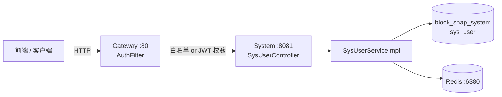
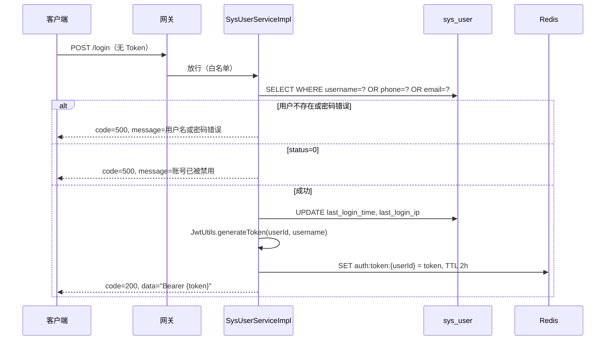
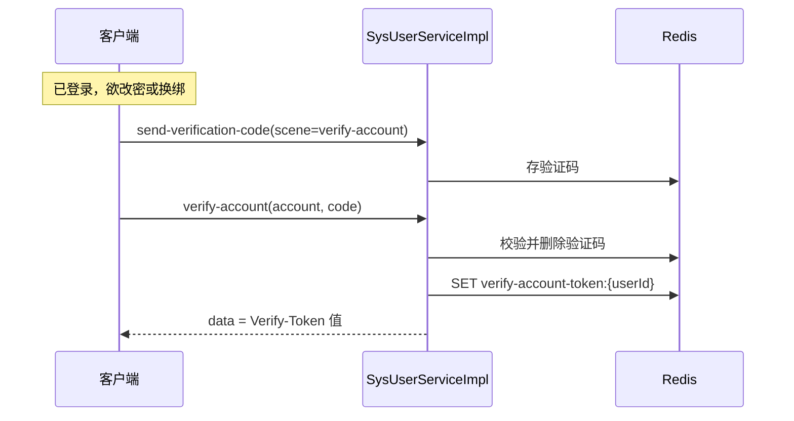
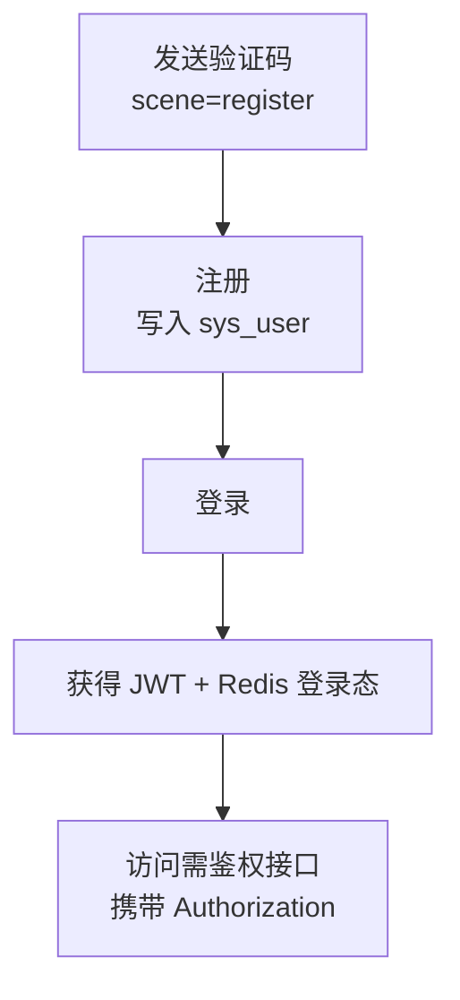
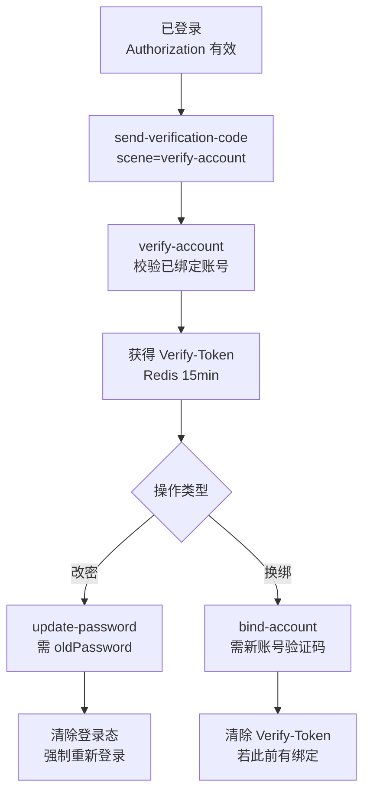
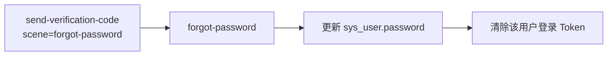
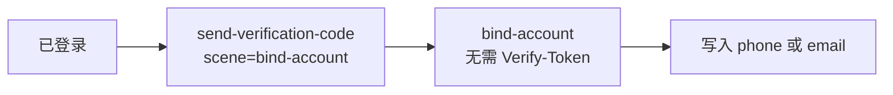
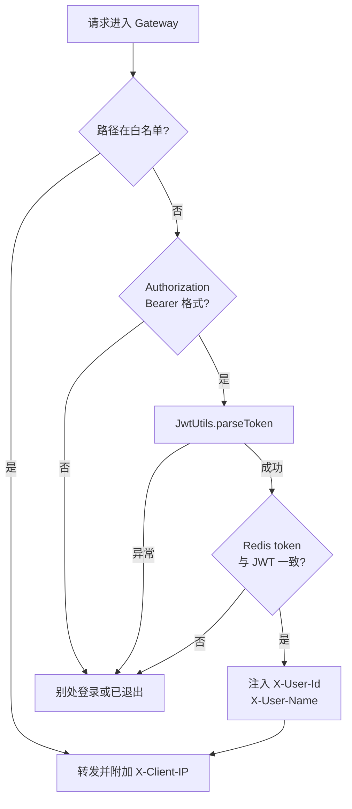

# sys-user 接口与用户数据流转

> 依据：`默认模块.openapi.yaml` + `block-snap-system` 模块 Controller / Service / Interceptor + `block-snap-gateway` AuthFilter  
> 网关入口：`http://localhost:80`，路由 `/sys-user/**` → `block-snap-system:8081`

---

## 1. 架构总览



**三层鉴权模型：**

| 层级 | 位置 | 作用 |
|------|------|------|
| L1 网关 JWT | `AuthFilter` | 除白名单外，校验 `Authorization: Bearer <token>`，并与 Redis 登录态比对 |
| L2 用户身份 | Controller `@RequestHeader("X-User-Id")` | 网关解析 JWT 后注入 `X-User-Id`，业务层以该值操作用户 |
| L3 二次验证 | `VerifyTokenInterceptor` | 仅拦截 `update-password`、`bind-account`，校验 `Verify-Token` 头 |

---

## 2. 接口清单（OpenAPI ↔ 实现）

| 方法 | 路径 | OpenAPI 摘要 | 网关白名单 | 需要 Authorization | 需要 X-User-Id | 需要 Verify-Token |
|------|------|--------------|:----------:|:------------------:|:--------------:|:-----------------:|
| POST | `/sys-user/login` | 登录 | ✅ | ❌ | ❌ | ❌ |
| POST | `/sys-user/register` | 注册 | ✅ | ❌ | ❌ | ❌ |
| POST | `/sys-user/send-verification-code` | 发送验证码 | ✅ | ❌ | ❌ | ❌ |
| POST | `/sys-user/forgot-password` | 忘记密码（登录前） | ✅ | ❌ | ❌ | ❌ |
| POST | `/sys-user/logout` | 退出登录 | ❌ | ✅ | ✅ | ❌ |
| POST | `/sys-user/verify-account` | 二级账户验证 | ❌ | ✅ | ✅ | ❌ |
| POST | `/sys-user/bind-account` | 绑定手机/邮箱 | ❌ | ✅ | ✅ | 条件* |
| POST | `/sys-user/update-password` | 修改密码 | ❌ | ✅ | ✅ | ✅ |

\* **bind-account 的 Verify-Token 规则：** 若用户**尚未绑定**手机且邮箱均为空，拦截器直接放行（首次绑定无需二次验证）；若已绑定过任一联系方式，则必须携带有效 `Verify-Token`。

---

## 3. 统一响应体

```json
{
  "code": 200,
  "message": "操作成功",
  "data": "..."
}
```

| code | 含义 | 典型场景 |
|------|------|----------|
| 200 | 成功 | 正常业务返回 |
| 401 | 未授权 | 网关 Token 缺失/过期/与 Redis 不一致 |
| 500 | 失败 | 业务校验失败（`Result.failed` 或 `ApiException`） |

**登录成功时 `data` 为完整 Token 字符串：** `"Bearer eyJhbGciOiJIUzI1NiJ9..."`（前端后续请求原样放入 `Authorization` 头）。

---

## 4. Redis 缓存键（用户态核心）

| Key 模式 | 值 | TTL | 用途 |
|----------|-----|-----|------|
| `block-snap:auth:token:{userId}` | JWT 字符串 | 2 小时 | 登录态；网关每次请求比对 |
| `block-snap:system:verification-code:{scene}:{account}` | 6 位数字验证码 | 5 分钟 | 注册/绑定/忘记密码/二次验证 |
| `block-snap:system:cooldown:{scene}:{account}` | `"lock"` | 60 秒 | 发码频率限制 |
| `block-snap:system:verify-account-token:verify-account:{userId}` | UUID（无横线） | 15 分钟 | 二次验证凭证，对应请求头 `Verify-Token` |

**scene 取值（`SceneConst`）：**

| scene | 说明 | 发码前置条件 |
|-------|------|--------------|
| `register` | 注册 | 账号**不能**已存在于 sys_user |
| `bind-account` | 绑定新手机/邮箱 | 账号**不能**已被绑定 |
| `forgot-password` | 忘记密码 | 账号**必须**已绑定 |
| `verify-account` | 已登录用户二次验证 | 账号**必须**已绑定 |

---

## 5. 各接口 Service 层逻辑详解

### 5.1 POST `/sys-user/login` — 登录

**请求体（`LoginDTO`）：**

```json
{ "username": "admin", "password": "123456" }
```

> `username` 字段名虽叫 username，实际支持：**用户名 / 手机号 / 邮箱** 三选一。

**处理流程：**



**数据变更：**

- `sys_user.last_login_time`、`last_login_ip` 更新
- Redis 写入登录 Token（覆盖旧会话，实现单点登录）

---

### 5.2 POST `/sys-user/register` — 注册

**OpenAPI 请求体：**

```json
{
  "username": "user",
  "password": "123456",
  "confirmPassword": "123456",
  "phone": "18888888888",
  "email": "222222@gmail.com"
}
```

**实现额外字段（OpenAPI 未声明）：**

| 字段 | 说明 |
|------|------|
| `phoneVerificationCode` | 若填写 phone，则必填且需先 `send-verification-code` scene=`register` |
| `emailVerificationCode` | 若填写 email，则必填且需先发码 |

**处理流程：**

1. `password` 与 `confirmPassword` 必须一致
2. `username` 唯一性检查
3. 若提供 `phone`：格式校验 → 验证码校验（scene=register）→ 手机号唯一性
4. 若提供 `email`：同上
5. BCrypt 加密密码，写入 `sys_user`（`nickname` 默认 `新用户_{timestamp}`）
6. 删除已使用的验证码 Redis 键

**数据变更：** 新增 `sys_user` 一行；不自动登录。

---

### 5.3 POST `/sys-user/send-verification-code` — 发送验证码

**请求体：**

```json
{ "account": "15023785431", "scene": "verify-account" }
```

**处理流程：**

1. `account` 非空；60 秒内同 scene+account 不可重复发送（cooldown）
2. `account` 须匹配手机号或邮箱正则
3. 按 scene 判断账号是否应存在/不应存在（见上表）
4. 生成 6 位随机码，写入 Redis（5 分钟）
5. 当前实现：`System.out.println` 打印验证码（未接真实短信/邮件）

---

### 5.4 POST `/sys-user/forgot-password` — 忘记密码

**请求体：**

```json
{
  "account": "15023785431",
  "resetPassword": "123456",
  "confirmResetPassword": "123456",
  "verificationCode": "679061"
}
```

**处理流程：**

1. 按 phone 或 email 查 `sys_user`，不存在则失败
2. 校验 scene=`forgot-password` 的验证码
3. `resetPassword` 与 `confirmResetPassword` 一致
4. BCrypt 更新密码
5. 删除验证码 Redis 键 + **删除登录 Token**（强制重新登录）

---

### 5.5 POST `/sys-user/logout` — 退出登录

**请求头：** `Authorization` + `X-User-Id`（网关注入）

**处理流程：**

1. 删除 `auth:token:{userId}`
2. 删除 `verify-account-token:verify-account:{userId}`

**数据变更：** 仅 Redis，不改 `sys_user`。

---

### 5.6 POST `/sys-user/verify-account` — 二级账户验证

**请求头：** `Authorization` + `X-User-Id`

**请求体（`VerifyAccountDto`）：**

```json
{ "account": "15023785431", "verificationCode": "121776" }
```

> OpenAPI 还要求 body 中 `userId`，**实现以 Header `X-User-Id` 为准**，body 中的 `userId` 未使用。

**处理流程：**

1. 查当前用户，`account` 必须等于其已绑定的 `phone` 或 `email`（防越权）
2. 校验 scene=`verify-account` 的验证码
3. 删除验证码键
4. 生成 `verifyAccountToken`（UUID），写入 Redis 15 分钟
5. 返回 `data = verifyAccountToken`（前端后续放入 `Verify-Token` 请求头）



---

### 5.7 POST `/sys-user/bind-account` — 绑定账户

**请求头：** `Authorization` + `X-User-Id` +（已绑定过时）`Verify-Token`

**请求体（`BindAccountDTO`，实现为 JSON；OpenAPI 写的是 multipart，与实现不一致）：**

```json
{ "account": "new@email.com", "verificationCode": "123456" }
```

**处理流程：**

1. `VerifyTokenInterceptor`：无手机且无邮箱 → 跳过二次验证；否则校验 `Verify-Token`
2. `account` 格式为手机或邮箱
3. 校验 scene=`bind-account` 的验证码
4. 目标手机/邮箱未被其他用户占用
5. 更新 `sys_user.phone` 或 `sys_user.email`
6. 删除验证码；若用户**之前已有绑定**，同时删除二次验证 Token（一次性凭证）

---

### 5.8 POST `/sys-user/update-password` — 修改密码

**请求头：** `Authorization` + `X-User-Id` + `Verify-Token`（**必须**）

**请求体（`UpdatePasswordDTO`）：**

```json
{
  "oldPassword": "666666",
  "newPassword": "123456",
  "confirmNewPassword": "123456"
}
```

**处理流程：**

1. 拦截器校验 `Verify-Token`
2. `newPassword` 与 `confirmNewPassword` 一致
3. `oldPassword` BCrypt 匹配当前密码
4. 新密码不能与原密码相同
5. BCrypt 更新密码
6. 删除二次验证 Token + 登录 Token → 提示重新登录

---

## 6. 用户完整生命周期（数据流转）

### 6.1 新用户：注册 → 登录



| 阶段 | 持久化 | 缓存 |
|------|--------|------|
| 发码 | — | verification-code:register:{account} |
| 注册 | INSERT sys_user | 删除验证码 |
| 登录 | UPDATE last_login_* | SET auth:token:{userId} |

---

### 6.2 已登录用户：敏感操作（改密 / 换绑）



**设计意图：** 改密、换绑属于高危操作；已绑定联系方式的用户必须先证明「能收到原手机/邮箱验证码」，再执行变更。

---

### 6.3 未登录：忘记密码



---

### 6.4 首次绑定（无手机无邮箱）



---

## 7. 网关 AuthFilter 数据流



**白名单路径：**

- `/sys-user/login`
- `/sys-user/register`
- `/sys-user/send-verification-code`
- `/sys-user/forgot-password`

---

## 8. sys_user 表字段与接口关系

| 字段 | 读 | 写 | 涉及接口 |
|------|:--:|:--:|----------|
| `id` | ✅ | — | 登录生成 JWT；网关传 X-User-Id |
| `username` | ✅ | 注册 | login（三选一登录）、register |
| `password` | ✅ | 注册/改密/重置 | login、register、update-password、forgot-password |
| `nickname` | — | 注册 | register 自动生成 |
| `phone` | ✅ | 注册/绑定 | login、register、bind-account、verify-account |
| `email` | ✅ | 注册/绑定 | 同上 |
| `status` | ✅ | — | login 校验（0=禁用） |
| `last_login_ip` | — | 登录 | login |
| `last_login_time` | — | 登录 | login |
| `is_deleted` | MP 逻辑删除 | — | 所有查询自动过滤 |

---

## 9. OpenAPI 与实现差异（对接时注意）

| 接口 | OpenAPI | 实际实现 | 建议 |
|------|---------|----------|------|
| `register` | 仅 phone/email | 还需 `phoneVerificationCode` / `emailVerificationCode`；发码 scene=`register` | 补充 OpenAPI 字段 |
| `bind-account` | `multipart/form-data` 空 schema | `application/json`：`account` + `verificationCode` | 以 JSON 为准 |
| `verify-account` | body 必填 `userId` | 仅用 Header `X-User-Id` | 前端不必传 body.userId |
| `send-verification-code` | scene 仅列 forgot-password、verify-account | 还支持 `register`、`bind-account` | 补充 scene 枚举 |
| 全局 | 未描述网关白名单 | 4 个接口免 Token | 文档已在上表标明 |

---

## 10. 前端请求头约定

| 头 | 何时携带 | 来源 |
|----|----------|------|
| `Authorization` | 除白名单外所有接口 | 登录返回的 `data`（含 `Bearer ` 前缀） |
| `X-User-Id` | 网关自动注入；Controller 显式读取的接口需存在 | 网关从 JWT 解析，**前端一般不需手动传**（除非直连 system 模块调试） |
| `Verify-Token` | `update-password`；`bind-account`（已绑定过联系方式时） | `verify-account` 返回的 `data` |

---

## 11. 典型错误与含义

| message | 触发位置 |
|---------|----------|
| 用户名或密码错误 | login |
| 账号已被禁用，请联系管理员 | login，status=0 |
| 验证码发送太频繁，请60秒后再试 | send-verification-code |
| 该账号已被注册或绑定，无法发送 | 发码 scene=register/bind-account |
| 该账号不存在或未绑定，无法发送 | 发码 scene=forgot-password/verify-account |
| 非法操作：该账号不是您当前绑定的账号！ | verify-account |
| 缺少二次验证凭证，请先完成安全验证！ | 拦截器，缺 Verify-Token |
| 二次验证无效或已过期 | 拦截器，Token 不匹配 |
| 您的账号已在别处登录或已退出 | 网关，Redis Token 不一致 |
| 密码修改成功，请重新登录 | update-password 成功（Token 已清） |

---

## 12. 与业务模块的数据关联（跨库）

用户登录后访问 `block-snap-service` 时，网关同样注入 `X-User-Id`：

```
sys_user.id  ──(X-User-Id)──►  instance.user_id
                              sys_user_mark.user_id
```

账号体系在 **system 库**完成；实例、模组、收藏备注在 **service 库 + system 库**通过 `user_id` 逻辑关联。详见《数据库表结构与关联关系.md》。
