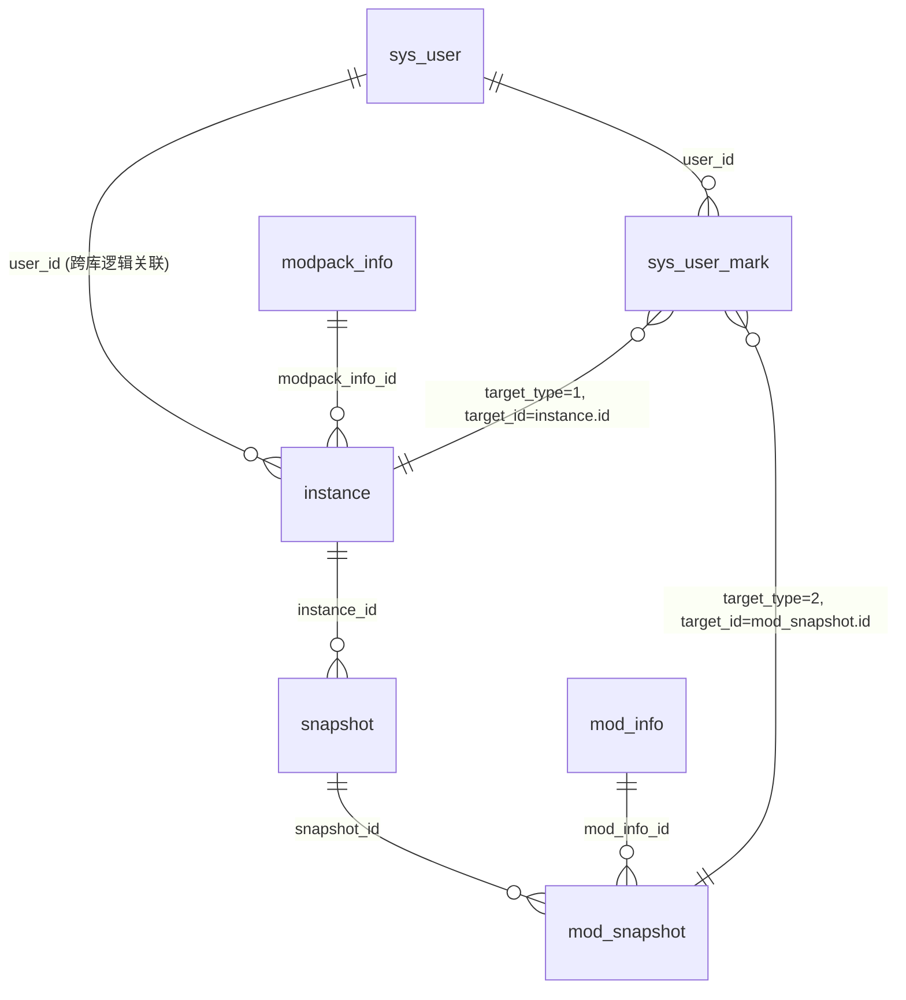

# Block-Snap 数据库表结构与关联关系

> 来源：`block-snap-service.sql`、`block-snap-system.sql`  
> 后端约定：一个微服务模块对应一个库；跨库关联通过 `库名.表名` 显式引用，**无物理外键约束**。

---

## 1. 总览

| 数据库 | 所属模块 | 职责 |
|--------|----------|------|
| `block_snap_system` | block-snap-system | 用户账号、用户侧收藏/备注 |
| `block_snap_service` | block-snap-service | 游戏实例、快照、模组等业务数据 |



---

## 2. 库：`block_snap_system`

### 2.1 `sys_user` — 系统用户表

| 字段 | 类型 | 约束 | 说明 |
|------|------|------|------|
| `id` | int | PK, AUTO_INCREMENT | 主键 |
| `username` | varchar(64) | NOT NULL | 用户名 |
| `password` | varchar(255) | NOT NULL | 密码（BCrypt） |
| `nickname` | varchar(64) | NULL | 昵称 |
| `phone` | varchar(20) | NULL | 手机号 |
| `email` | varchar(128) | NULL | 邮箱 |
| `remark` | varchar(500) | NULL | 用户备注 |
| `last_login_ip` | varchar(50) | NULL | 最后登录 IP |
| `last_login_time` | datetime | NULL | 最后登录时间 |
| `status` | tinyint | DEFAULT 1 | 1=正常，0=停用 |
| `is_deleted` | tinyint | DEFAULT 0 | 逻辑删除 |
| `create_time` | datetime | NOT NULL | 创建时间 |
| `update_time` | datetime | NOT NULL | 更新时间 |

**关联：**

- `sys_user.id` ← `sys_user_mark.user_id`（同库）
- `sys_user.id` ← `instance.user_id`（**跨库逻辑关联**，`block_snap_service.instance`）

---

### 2.2 `sys_user_mark` — 用户收藏/备注标记

| 字段 | 类型 | 约束 | 说明 |
|------|------|------|------|
| `id` | bigint | PK, AUTO_INCREMENT | 主键 |
| `user_id` | bigint | NOT NULL | 关联 `sys_user.id` |
| `target_id` | int | NOT NULL | 目标行主键（见下表） |
| `target_type` | tinyint | NOT NULL | 目标类型（见下表） |
| `favorite` | tinyint | DEFAULT 0, NOT NULL | 0=未收藏，1=已收藏 |
| `note` | varchar(512) | NULL | 用户备注 |
| `create_time` | datetime | NOT NULL | 创建时间 |
| `update_time` | datetime | NOT NULL | 更新时间 |

**`target_type` 与 `target_id` 对应关系：**

| target_type | 常量名 | target_id 指向 | 所在库 | 说明 |
|-------------|--------|----------------|--------|------|
| 1 | INSTANCE | `instance.id` | block_snap_service | 游戏实例收藏/备注 |
| 2 | MOD | `mod_snapshot.id` | block_snap_service | 模组收藏/备注 |
| 3 | MODPACK | `modpack_info.id` | block_snap_service | 整合包（预留） |
| 4 | RESOURCE | `mod_snapshot.id` | block_snap_service | 资源包（预留） |
| 5 | SHADER | `mod_snapshot.id` | block_snap_service | 光影包（预留） |
| 6 | CONFIG | `mod_snapshot.id` | block_snap_service | 配置文件（预留） |

> **设计要点：** 收藏/备注是**用户对某个业务对象的私有标记**，与 `instance`、`mod_snapshot` 等表解耦，统一存一张表，用 `(user_id, target_type, target_id)` 唯一定位一条标记。

---

## 3. 库：`block_snap_service`

### 3.1 `instance` — 游戏实例表

| 字段 | 类型 | 约束 | 说明 |
|------|------|------|------|
| `id` | int | PK, AUTO_INCREMENT | 实例 ID |
| `user_id` | bigint | NOT NULL | 关联 `block_snap_system.sys_user.id` |
| `modpack_info_id` | bigint | NULL | 关联 `modpack_info.id`（可选） |
| `client_key` | varchar(64) | NOT NULL | 客户端实例指纹（目录 hash / 启动器 UUID） |
| `name` | varchar(128) | NOT NULL | 用户可改名称 |
| `is_deleted` | tinyint | DEFAULT 0, NOT NULL | 逻辑删除 |
| `create_time` | datetime | NOT NULL | 创建时间 |
| `update_time` | datetime | NOT NULL | 修改时间 |

**关联：**

| 方向 | 关联字段 | 目标 | 基数 |
|------|----------|------|------|
| 归属用户 | `user_id` | `sys_user.id`（跨库） | N : 1 |
| 整合包 | `modpack_info_id` | `modpack_info.id` | N : 1（可空） |
| 快照 | — | `snapshot.instance_id` | 1 : N |
| 用户标记 | `id` | `sys_user_mark.target_id`（`target_type=1`） | 1 : N |

---

### 3.2 `snapshot` — 实例快照表头

每次游戏启动/采集产生一条快照，记录该次运行环境。

| 字段 | 类型 | 约束 | 说明 |
|------|------|------|------|
| `id` | int | PK, AUTO_INCREMENT | 快照 ID |
| `instance_id` | int | NOT NULL | 关联 `instance.id` |
| `mc_version` | varchar(32) | NULL | Minecraft 版本 |
| `loader_type` | tinyint | NULL | 1=FABRIC, 2=FORGE, 3=NEOFORGE, 4=QUILT |
| `loader_version` | varchar(32) | NULL | 加载器版本 |
| `java_version` | varchar(32) | NULL | Java 版本 |
| `load_ms` | int | NULL | 加载耗时（ms） |
| `snapshot_time` | datetime | NOT NULL | 快照采集/游戏启动时间 |
| `create_time` | datetime | NOT NULL | 创建时间 |
| `update_time` | datetime | NOT NULL | 更新时间 |

**关联：**

| 方向 | 关联字段 | 目标 | 基数 |
|------|----------|------|------|
| 所属实例 | `instance_id` | `instance.id` | N : 1 |
| 模组明细 | — | `mod_snapshot.snapshot_id` | 1 : N |

> **业务规则：** 「当前/最新快照」= 同一 `instance_id` 下按 `snapshot_time DESC, id DESC` 取第一条。

---

### 3.3 `mod_info` — 模组全局主数据

按平台项目维度去重的模组目录，存**最新版本**等元信息。

| 字段 | 类型 | 约束 | 说明 |
|------|------|------|------|
| `id` | int | PK, AUTO_INCREMENT | 模组 ID |
| `name` | varchar(256) | NULL | 模组名称 |
| `hash` | varchar(500) | NOT NULL | Mod 哈希值 |
| `platform` | tinyint | NOT NULL | 1=CURSEFORGE, 2=MODRINTH |
| `version` | varchar(32) | NULL | **平台最新版本号** |
| `url` | varchar(500) | NULL | 链接 |
| `icon` | varchar(300) | NULL | 图标 |
| `create_time` | datetime | NOT NULL | 创建时间 |
| `update_time` | datetime | NOT NULL | 更新时间 |

**关联：**

| 方向 | 关联字段 | 目标 | 基数 |
|------|----------|------|------|
| 快照行 | — | `mod_snapshot.mod_info_id` | 1 : N |

---

### 3.4 `mod_snapshot` — 快照下的模组行

某次快照中具体安装了哪个模组、什么版本；**列表接口返回的 `id` 即本表主键**。

| 字段 | 类型 | 约束 | 说明 |
|------|------|------|------|
| `id` | int | PK, AUTO_INCREMENT | 主键（API 对外 id / mark 的 target_id） |
| `snapshot_id` | int | NOT NULL | 关联 `snapshot.id` |
| `mod_info_id` | int | NULL | 关联 `mod_info.id` |
| `version` | varchar(50) | NULL | **当前安装版本** |
| `mod_hash` | varchar(300) | NULL | 该快照下 Mod 的 SHA-256 |
| `load_time` | bigint | NULL | 加载耗时（ms） |
| `is_deleted` | tinyint | DEFAULT 0 | 0=活跃, 1=已移除, 2=禁用 |
| `added_time` | datetime | NULL | 模组添加时间 |
| `update_time` | datetime | NULL | 模组修改时间 |
| `create_time` | datetime | NOT NULL | 行创建时间 |

**关联：**

| 方向 | 关联字段 | 目标 | 基数 |
|------|----------|------|------|
| 所属快照 | `snapshot_id` | `snapshot.id` | N : 1 |
| 模组主数据 | `mod_info_id` | `mod_info.id` | N : 1（可空） |
| 用户标记 | `id` | `sys_user_mark.target_id`（`target_type=2`） | 1 : N |

> **版本对比：** `mod_info.version`（最新）与 `mod_snapshot.version`（当前）不一致 → `isNewVersion=2`（非最新），否则为 `1`。

---

### 3.5 `modpack_info` — 整合包全局主数据

| 字段 | 类型 | 约束 | 说明 |
|------|------|------|------|
| `id` | int | PK, AUTO_INCREMENT | 内部主键 |
| `platform` | tinyint | NOT NULL | 1=MODRINTH, 2=CURSEFORGE, 3=FTB, 4=TECHNIC |
| `modpack_id` | int | NOT NULL | 平台整合包项目 ID |
| `name` | varchar(128) | NULL | 整合包名称 |
| `version` | varchar(64) | NULL | 最新版本号 |
| `version_id` | int | NULL | 平台侧版本 ID |
| `create_time` | datetime | NOT NULL | 创建时间 |
| `update_time` | datetime | NOT NULL | 更新时间 |

**关联：**

| 方向 | 关联字段 | 目标 | 基数 |
|------|----------|------|------|
| 实例 | — | `instance.modpack_info_id` | 1 : N |
| 用户标记 | `id` | `sys_user_mark.target_id`（`target_type=3`，预留） | 1 : N |

---

## 4. 核心数据链路

### 4.1 从用户到模组列表

```
sys_user (system)
  └── instance (service)          user_id 过滤 + is_deleted=0
        └── snapshot (service)    按 snapshot_time 取最新一条
              └── mod_snapshot (service)   每行一个模组
                    ├── mod_info (service)  取 name、最新 version
                    └── sys_user_mark (system, 跨库)  target_type=2, target_id=mod_snapshot.id
```

**查询条件示例（`/svc-mod/list`，对应 `ModSnapshotMapper.xml#selectListByInstanceId`）：**

1. `instance.id = :instanceId AND instance.user_id = :userId AND is_deleted = 0` — 归属校验
2. 取该 instance 最新 `snapshot`（`ORDER BY snapshot_time DESC, id DESC LIMIT 1`）
3. 取该 snapshot 下全部 `mod_snapshot`
4. **INNER JOIN** `mod_info`（非 LEFT JOIN）、LEFT JOIN `block_snap_system.sys_user_mark`

> **实现细节，非设计意图**：第 4 步对 `mod_info` 用的是 INNER JOIN，不是 LEFT JOIN。这意味着如果某条 `mod_snapshot.mod_info_id` 为空或未能匹配到 `mod_info`（表结构允许 `mod_info_id` 为 NULL），该模组会从列表中**整行消失**，而不是以"无法识别版本信息"的降级形式展示。如果这不是预期行为，需要在后续实现里把这一步改成 LEFT JOIN 并给 `name`/`version` 兜底默认值。

### 4.2 从用户到实例列表

```
sys_user (system)
  └── instance (service)
        ├── sys_user_mark (system, 跨库)     target_type=1, target_id=instance.id
        ├── snapshot (service)               最新 + 上一条（算 updateCount）
        │     └── mod_snapshot (service)     统计 modCount、版本变动
        └── modpack_info (service)           整合包名称/版本/平台
```

### 4.3 收藏/备注写入

| 接口 | 校验对象 | 写入表 | target_type | target_id |
|------|----------|--------|-------------|-----------|
| `/svc-instance/favorite`、`/note` | `instance` 存在且 `user_id` 匹配 | `sys_user_mark` | 1 | `instance.id` |
| `/svc-mod/favorite`、`/note` | `mod_snapshot` 存在 | `sys_user_mark` | 2 | `mod_snapshot.id` |

写入模式：**先 UPDATE，影响行数为 0 再 INSERT**（upsert）。

---

## 5. 关系图（按业务层级）

```
┌─────────────────────────────────────────────────────────────────┐
│                    block_snap_system                             │
│  ┌──────────┐         ┌─────────────────┐                       │
│  │ sys_user │ 1───N   │ sys_user_mark   │                       │
│  │   .id    │◄────────│   .user_id      │                       │
│  └────┬─────┘         │   .target_type  │                       │
│       │               │   .target_id    │──┐                    │
│       │ (逻辑)        └─────────────────┘  │ 多态指向           │
└───────┼────────────────────────────────────┼────────────────────┘
        │ user_id                            │
        ▼                                    │
┌─────────────────────────────────────────────────────────────────┐
│                    block_snap_service                            │
│  ┌──────────┐    ┌─────────────┐    ┌──────────────┐          │
│  │ instance │◄───│  snapshot   │◄───│ mod_snapshot │◄─┘       │
│  │   .id    │ 1N │ instance_id │ 1N │ snapshot_id  │  type=2   │
│  └────┬─────┘    └─────────────┘    └──────┬───────┘          │
│       │ ▲ type=1                            │ mod_info_id        │
│       │                                     ▼                    │
│  ┌────┴─────────┐                   ┌──────────┐               │
│  │ modpack_info │                   │ mod_info │               │
│  │ (可选关联)    │                   │ (全局目录)│               │
│  └──────────────┘                   └──────────┘               │
└─────────────────────────────────────────────────────────────────┘
```

---

## 6. 枚举与状态码汇总

### 6.1 `sys_user_mark.target_type`

| 值 | 含义 | target_id 表 |
|----|------|--------------|
| 1 | INSTANCE | instance |
| 2 | MOD | mod_snapshot |
| 3 | MODPACK | modpack_info |
| 4 | RESOURCE | mod_snapshot（预留） |
| 5 | SHADER | mod_snapshot（预留） |
| 6 | CONFIG | mod_snapshot（预留） |

### 6.2 `mod_info.platform` / `modpack_info.platform`

| 表 | 值 | 平台 |
|----|-----|------|
| mod_info | 1 | CURSEFORGE |
| mod_info | 2 | MODRINTH |
| modpack_info | 1 | MODRINTH |
| modpack_info | 2 | CURSEFORGE |
| modpack_info | 3 | FTB |
| modpack_info | 4 | TECHNIC |

### 6.3 `snapshot.loader_type`

| 值 | 加载器 |
|----|--------|
| 1 | FABRIC |
| 2 | FORGE |
| 3 | NEOFORGE |
| 4 | QUILT |

### 6.4 `mod_snapshot.is_deleted`

| 值 | 含义 |
|----|------|
| 0 | 活跃 |
| 1 | 已移除 |
| 2 | 禁用 |

---

## 7. 跨库访问说明

- **同一 MySQL 实例**下两库可通过 `block_snap_system.sys_user_mark` 写法跨库 JOIN/UPDATE。
- `block-snap-service` 主数据源指向 `block_snap_service`；`sys_user_mark` 的读写均在 XML 中用全限定表名完成。
- **无物理外键**：`instance.user_id`、`sys_user_mark.target_id` 等均为应用层逻辑约束。

---

## 8. 类型与文档差异备忘

| 项 | SQL 文件现状 | 说明 |
|----|--------------|------|
| `instance.modpack_info_id` | bigint | `modpack_info.id` 为 int，逻辑可关联，类型略不一致 |
| `sys_user.id` | int | `instance.user_id`、`sys_user_mark.user_id` 为 bigint |
| `mod_snapshot.is_deleted` | 列名 `is_deleted` | 若库表已改为 `is_deleted`，请以实际库结构为准，并同步 SQL 文档 |

---

## 9. 表清单速查

| 库 | 表名 | 一句话 |
|----|------|--------|
| block_snap_system | sys_user | 登录账号 |
| block_snap_system | sys_user_mark | 用户对实例/模组等的收藏与备注 |
| block_snap_service | instance | 用户的一个 MC 实例（整合包/目录） |
| block_snap_service | snapshot | 某次启动的环境快照头 |
| block_snap_service | mod_snapshot | 某次快照里的一条模组记录 |
| block_snap_service | mod_info | 模组全局元数据（含最新版本） |
| block_snap_service | modpack_info | 整合包全局元数据 |
